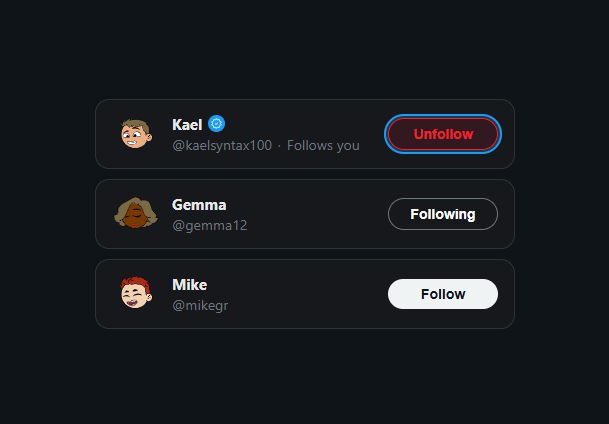
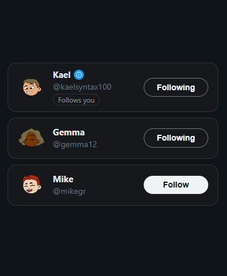

# 🐦 Twitter Follow Card — Project 01

<!-- markdownlint-disable MD033 -->
<p align="center">
  <strong>Reusable Twitter Follow Card built with React</strong>
</p>

<p align="center">
  <a href="https://react.dev/">
    
  </a>
  <a href="https://vitejs.dev/">
    
  </a>
  <a href="https://01-twitter-follow-card.pages.dev/">
    
  </a>
</p>
<!-- markdownlint-enable MD033 -->

---

## 🚀 Live Demo

🔗 [Live Demo](https://01-twitter-follow-card.pages.dev/)

---

## 🧠 Overview

This project marks the **first practical build** in the `react-learning` repository.

The goal was to create a **reusable and scalable Twitter Follow Card component**, applying core React principles while keeping a clean and modular architecture.

---

## 🎯 Key Learnings

- **Component Composition** - building modular UI with reusable components
- **State Management (`useState`)** - handling interactive UI state
- **Conditional Rendering** - dynamic UI updates
- **Props Design** - simplifying components with boolean props and defaults
- **Separation of Concerns** - clean separation between logic and styling

---

## ✨ Features

- Reusable `TwitterFollowCard` component
- Interactive states: `Follow`, `Following`, `Unfollow`
- `VerifiedBadge` as a separate atomic component
- Avatar fallback handling
- Accessibility support (`aria-label`, `:focus-visible`)
- Responsive layout

---

## 🛠 Tech Stack

- React
- Vite
- CSS
- Cloudflare Pages

---

## 📸 Screenshots

### 🖥 Desktop



### 📱 Mobile



---

## 📁 Project Structure

```txt
src/
 ├── App.jsx               # Main orchestrator
 ├── TwitterFollowCard.jsx # Core logic and UI
 ├── VerifiedBadge.jsx     # Reusable atomic component
 └── assets/
    ├── index.css          # Global styles and resets
    └── app.css            # Layout-specific styling
```

---

## ⚙️ Getting Started

```bash
git clone https://github.com/kaelsyntax/react-learning.git
cd react-learning/projects/01-twitter-follow-card
npm install
npm run dev
```

---

## 📦 Build

```bash
npm run build
```

---

## 👤 Author

**KaelSyntax**

---

## 📌 Status

`v1 — Completed`
