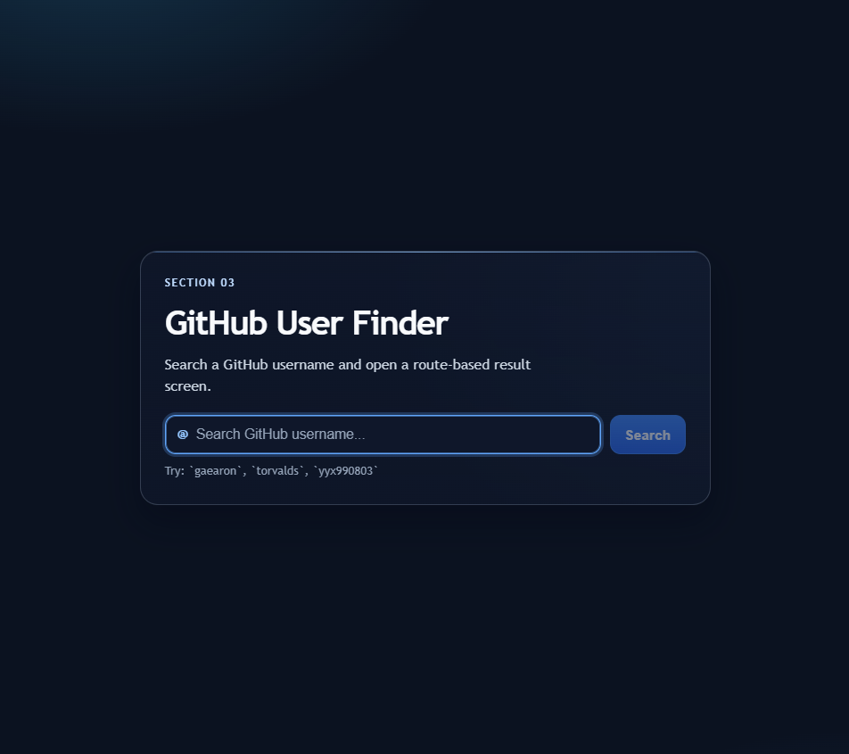
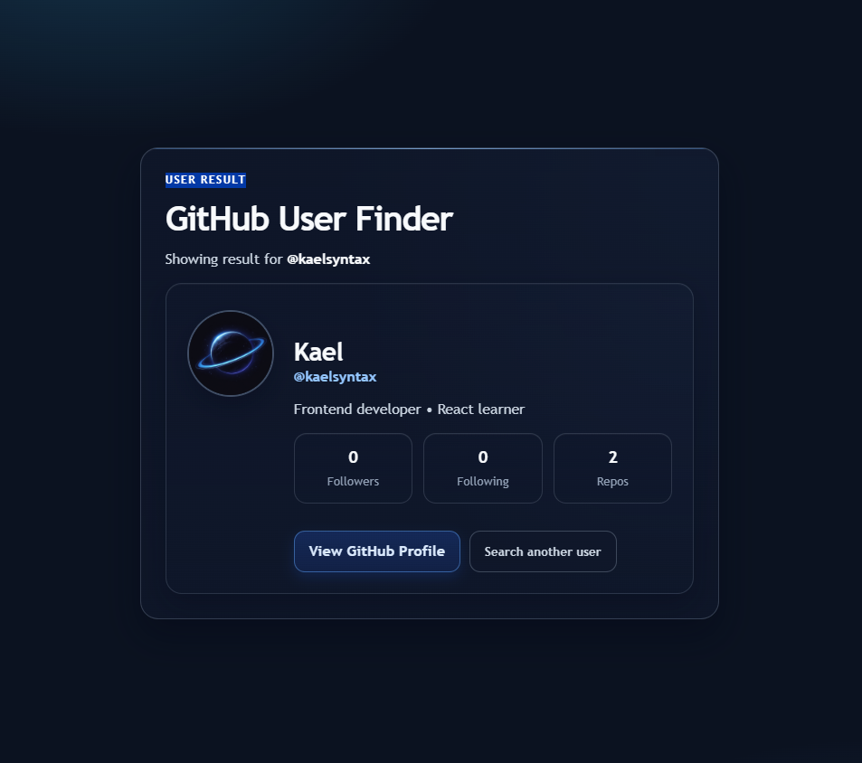
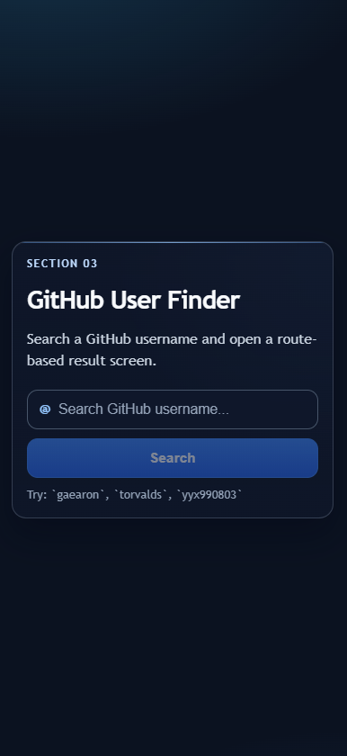
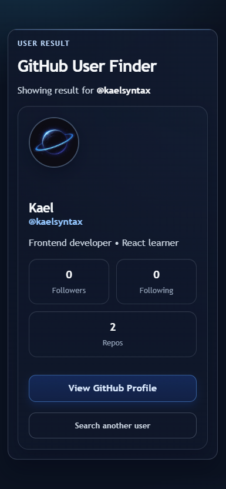

# 🐙🔎 GitHub User Finder — Project 03

<!-- markdownlint-disable MD033 -->
<p align="center">
  <strong>Route-based GitHub profile finder built with React</strong>
</p>

<p align="center">
  <a href="https://react.dev/">
    
  </a>
  <a href="https://vitejs.dev/">
    
  </a>
  <a href="https://03-github-user-finder.pages.dev/">
    
  </a>
</p>
<!-- markdownlint-enable MD033 -->

---

## 🚀 Live Demo

🔗 [Live Demo](https://03-github-user-finder.pages.dev/)

---

## 🧠 Overview

This project is the **third practical build** in the `react-learning` repository.

It combines async data fetching patterns with route-driven UI architecture, while keeping logic reusable through custom hooks.

---

## 💡 Why This Project

This build practices real frontend flows where users navigate by URL, trigger async searches, and handle multiple UI states (loading, success, error) clearly.

It also reinforces code quality through reusable hooks and safe request handling.

---

## 🎯 Key Learnings

- Controlled search flow with route navigation
- Fetch lifecycle management with `useEffect`
- Request cancellation using `AbortController`
- Custom hooks (`useFetchUser`, `useDebounce`)
- Async state modeling for user-facing feedback
- Basic client-side routing (home, dynamic user route, 404)
- Responsive UI and practical accessibility patterns

---

## ✨ Features

- Search GitHub users from a controlled form
- Route-based results at `/user/:username`
- Dynamic route param decoding and URL-safe navigation
- Debounced profile lookup
- Safe async handling with abort logic to avoid stale updates
- Profile states with skeleton loading, success, and error feedback
- Recovery action for failed searches (`Search another user`)
- Custom 404 page for unknown routes
- Responsive profile layout with optimized mobile behavior

---

## 🛠 Tech Stack

- React
- Vite
- CSS

---

## 📸 Screenshots

### 🖥️ Desktop - Home



### 🖥️ Desktop - User



### 📱 Mobile - Home



### 📱 Mobile - User



---

## 📁 Project Structure

```txt
src/
├── App.jsx                    # Route switching and navigation logic
├── App.css                    # Component-level styling and responsive rules
├── index.css                  # Global styles and background
├── main.jsx                   # App bootstrap
├── components/
│   └── SearchForm.jsx         # Controlled search form UI
├── hooks/
│   ├── useDebounce.js         # Debounce utility hook
│   └── useFetchUser.js        # GitHub fetch lifecycle hook
└── pages/
    ├── Home.jsx               # Home/search route
    ├── User.jsx               # User profile route
    └── NotFound.jsx           # Fallback route
```

---

## ⚙️ Getting Started

```bash
git clone https://github.com/kaelsyntax/react-learning.git
cd react-learning/projects/03-github-user-finder
npm install
npm run dev
```

---

## 📦 Build

```bash
npm run build
```

---

## 👤 Author

**KaelSyntax**

---

## 📌 Status

**v1 — Completed**
