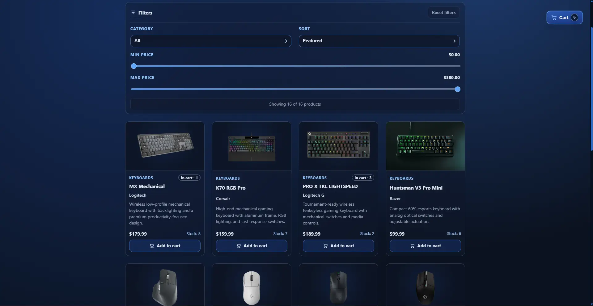
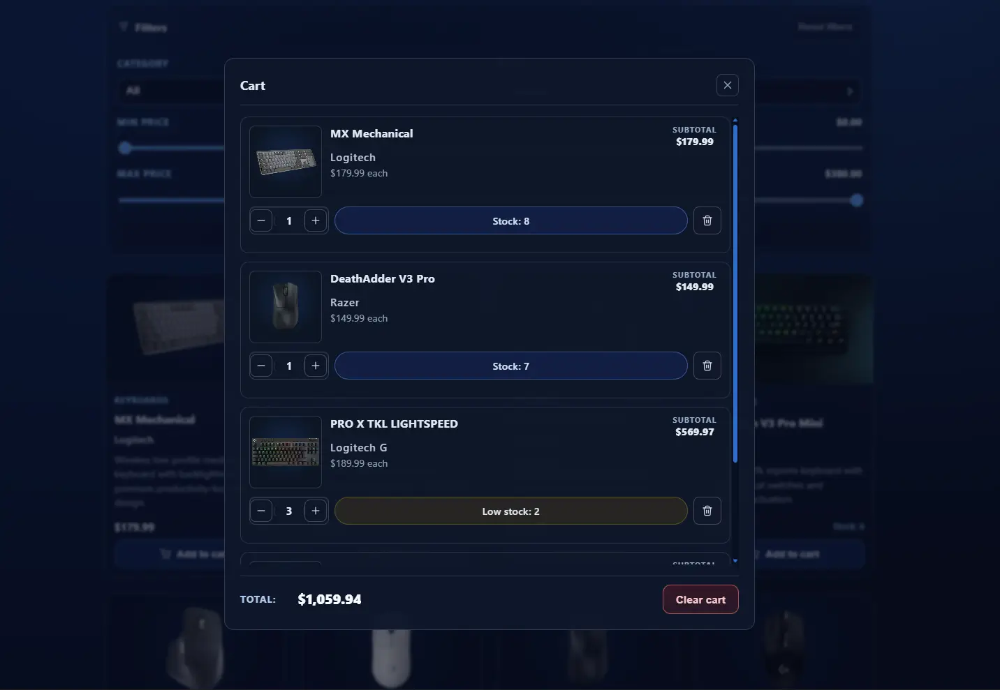
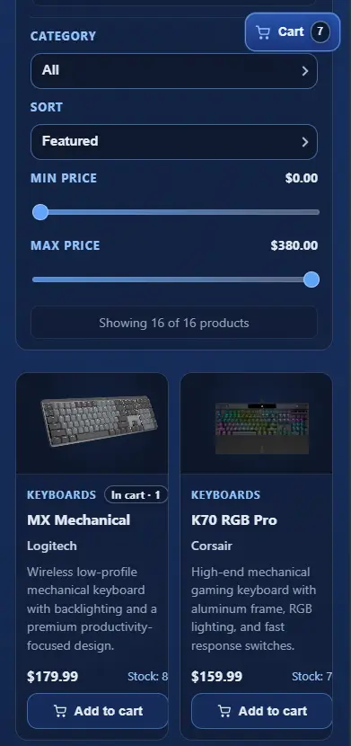
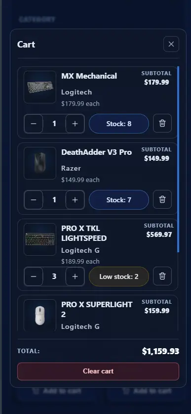

# 🛒 Ecommerce Cart - Project 04

<!-- markdownlint-disable MD033 -->
<p align="center">
  <strong>Interactive ecommerce catalog and animated cart flow built with React</strong>
</p>

<p align="center">
  <a href="https://react.dev/">
    
  </a>
  <a href="https://vitejs.dev/">
    
  </a>
  
</p>
<!-- markdownlint-enable MD033 -->

---

## 🚀 Live Demo

🔗 [Live Demo](https://04-ecommerce-cart.pages.dev/)

## 🧠 Overview

This project is the fourth practical build in the `react-learning` repository.

It focuses on scalable cart state management, smooth transitions, filterable product catalog UX, and accessibility-minded interaction patterns.

---

## 💡 Why This Project

This build practices a realistic ecommerce flow:

- Filter and sort products in a responsive catalog
- Add/remove items with animated quantity controls
- Manage cart state with reducer architecture
- Handle animated modal/cart transitions without sacrificing accessibility

---

## 🎯 Key Learnings

- Context + reducer state architecture for cart domain logic
- Selector/action separation (`domain/cart/*`)
- Derived data handling for stock and totals
- Transition orchestration with custom hooks
- Micro-interactions and animated UI feedback
- Hook lint compliance and cleanup patterns for release quality
- Responsive and keyboard-friendly modal/cart behavior

---

## ✨ Features

- Product filtering by category and price range
- Product sorting options
- Add to cart with stepper controls and stock-aware constraints
- Floating cart toggle with animated item badge
- Cart modal with:
  - animated item enter/exit transitions
  - subtotal and total value roll animations
  - clear cart and item remove actions
  - focus handoff and keyboard support
- Empty states for catalog and cart
- Reduced-motion support via media query

---

## 🛠 Tech Stack

- React
- Vite
- CSS

---

## 📁 Project Structure

```txt
src/
├── App.jsx
├── App.css
├── index.css
├── main.jsx
├── components/
│   ├── cart/
│   ├── filters/
│   ├── products/
│   └── shared/
├── context/
│   ├── cart-context.jsx
│   └── filters-context.jsx
├── domain/
│   └── cart/
│       ├── cart-actions.js
│       ├── cart-reducer.js
│       ├── cart-selectors.js
│       └── cart-transitions.js
├── hooks/
│   ├── useCart.js
│   ├── useCartItemsTransition.js
│   ├── useCartPanelModal.js
│   ├── useFilteredProducts.js
│   ├── useFilters.js
│   ├── useProductCardStepper.js
│   └── useProductsTransition.js
├── mocks/
│   └── products.json
└── utils/
    ├── format-price.js
    └── product-image-crop.js

tests/
├── components/
│   └── cart-flow.test.jsx
├── domain/
│   └── cart/
│       ├── cart-reducer.test.js
│       ├── cart-selectors.test.js
│       └── cart-transitions.test.js
└── hooks/
    ├── useCart.test.jsx
    ├── useFilteredProducts.test.jsx
    └── useFilters.test.jsx

```

---

## ⚙️ Getting Started

```bash
git clone https://github.com/kaelsyntax/react-learning.git
cd react-learning/projects/04-ecommerce-cart
npm install
npm run dev
```

---

## 📦 Build

```bash
npm run lint
npm run test
npm run build
```

---

## 📸 Screenshots

### 🖥️ Desktop - Home



### 🖥️ Desktop - Cart



### 📱 Mobile - Home



### 📱 Mobile - Cart



---

## 👤 Author

**KaelSyntax**

---

## 📌 Status

**v1 - Ready**

Planned next improvements:

- End-to-end flow checks for cart modal interactions
