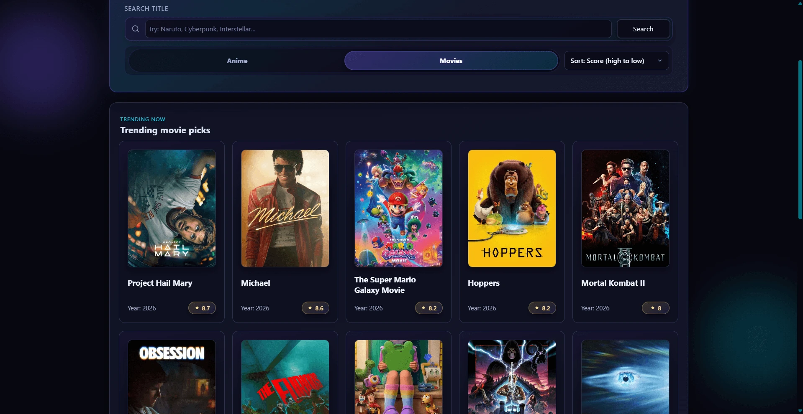
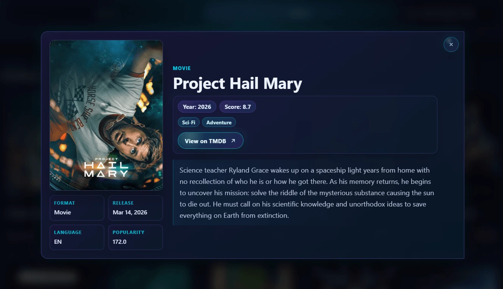
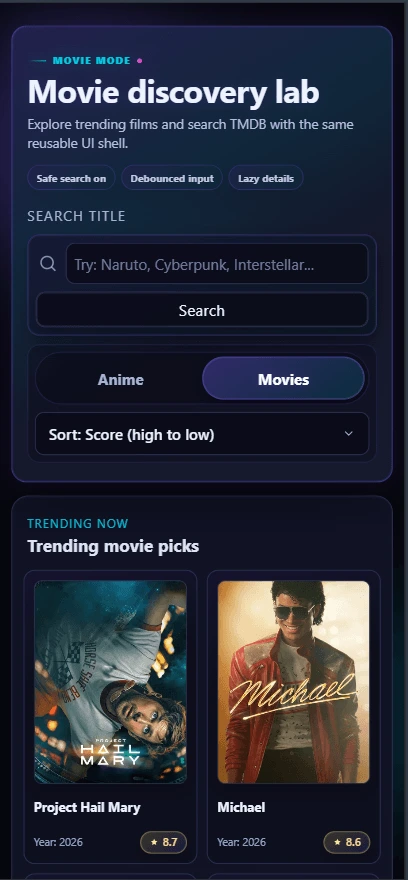
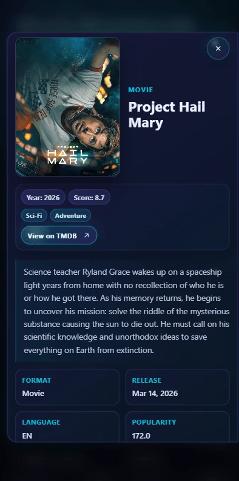

# ⚙️ Media Search Performance Lab - Project 05

Interactive media search experience focused on React rendering behavior, render stability, and practical performance optimization.

---

## 🚀 Live Demo

🔗 [Live Demo](https://05-media-search-performance-lab.pages.dev/)

---

## 🧠 Overview

This project is the **fifth practical build** in the `react-learning` repository.

It applies performance-focused React patterns in a search-driven interface with two data modes: anime and movies. The app combines reusable UI, custom hooks, API adapters, loading states, responsive result cards, and a lazy-loaded details modal.

---

## 💡 Why This Project

This build practices performance-minded React development in a realistic search flow.

It is designed to balance render optimization, perceived performance, and polished UI states without overusing memoization or adding unnecessary abstractions.

---

## 🎯 Key Learnings

- Search-driven UI with `anime` and `movies` modes
- Memoized derived data with `useMemo`
- Stable interaction handlers with `useCallback`
- Code splitting with `lazy` and `Suspense`
- API boundaries through services and adapters
- Perceived performance with loading, shimmer, and lazy image strategies
- Accessible modal behavior with focus management and keyboard support
- Responsive modal and result-grid polish across breakpoints

---

## ✨ Features

- Anime and movie search modes.
- Trending discovery results before the first search.
- Search input with validation and optimized query flow.
- Sort controls for score and year.
- Responsive result grid with poster cards.
- Diagonal shimmer/fade-in image loading for result posters.
- Loading, error, empty, and info states.
- Lazy-loaded details modal with poster, stats, genres, facts, synopsis, and external source link.
- Accessible modal behavior with focus management, escape close, and focus return.
- Mobile and tablet-specific modal layouts.

---

## 🛠 Tech Stack

- React
- Vite
- CSS
- Jikan API for anime data
- TMDB API for movie data

---

## 📸 Screenshots

### 🖥️ Desktop - Results



### 🖥️ Desktop - Details



### 📱 Mobile - Results



### 📱 Mobile - Details



---

## 📁 Project Structure

```txt
src/
├── App.jsx
├── index.css
├── main.jsx
├── adapters/
│   ├── anime-adapter.js
│   └── movie-adapter.js
├── components/
│   ├── controls/
│   └── results/
├── hooks/
│   └── useMediaSearch.js
├── services/
│   ├── anime-api.js
│   └── movie-api.js
└── styles/
```

---

## ⚙️ Getting Started

```bash
cd react-learning/projects/05-media-search-performance-lab
npm install
npm run dev
```

Create a `.env.local` file if you want movie search support through TMDB:

```bash
VITE_TMDB_READ_ACCESS_TOKEN=your_tmdb_read_access_token
```

Anime search works through the public Jikan API.

---

## 📦 Build

```bash
npm run lint
npm run build
```

---

## 👤 Author

**KaelSyntax**

---

## 📌 Status

**v1 — Completed**
